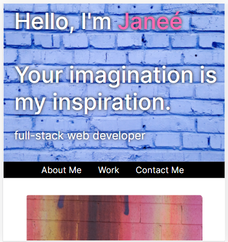

# Professional-Portfolio

## Description
Updated portfolio featuring at least 3 examples of student work from either deployed projects of homeworks

### Tools
The tools I utilized to create my portfolio were unsplash stock photos, font-awesome, ajax icons, bootstrap grid systems, and css. 

**Links to deployed portfolio and repo**
https://janee-elise-mays.github.io/professional-portfolio/
https://github.com/janee-elise-mays/professional-portfolio

